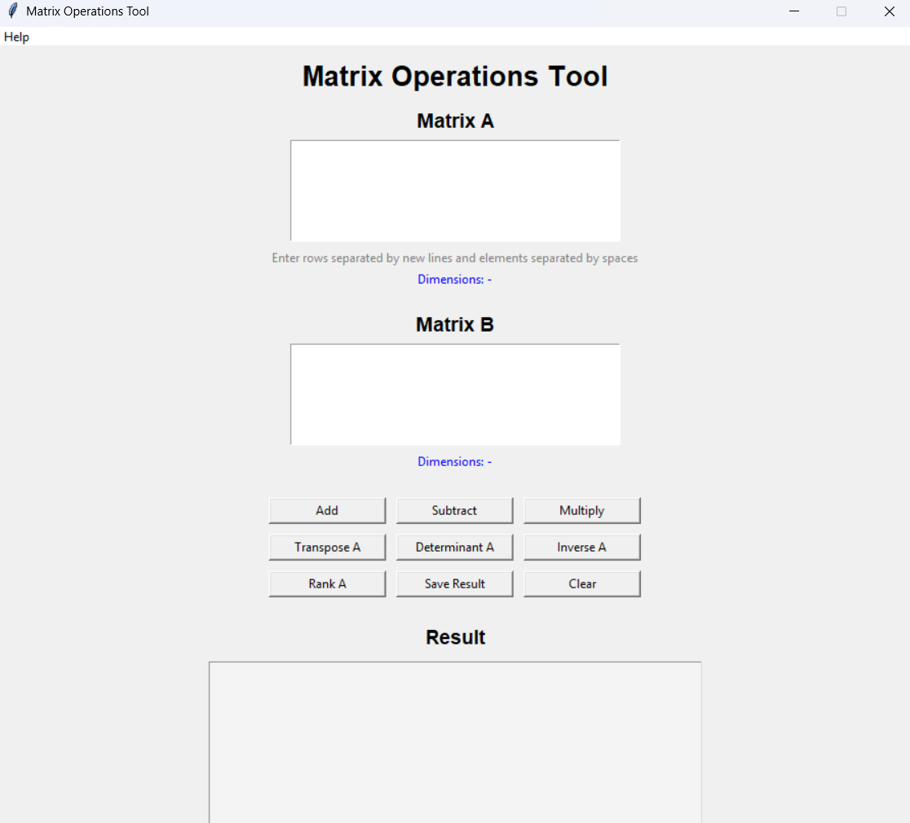
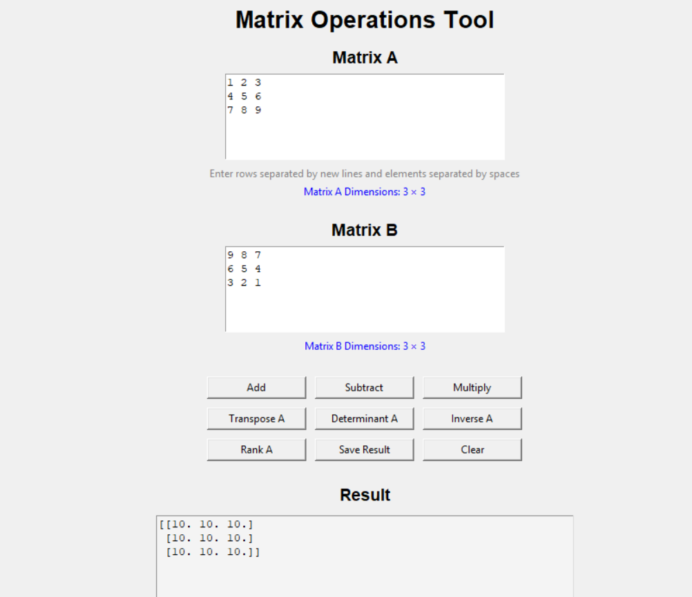
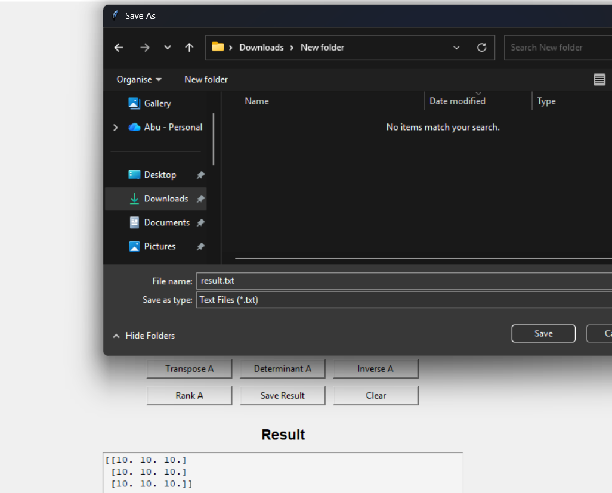

# Matrix Operations Tool

An interactive desktop application built with Python, NumPy, and Tkinter for performing various matrix operations through a user-friendly graphical interface.

## Features

* Matrix Addition
* Matrix Subtraction
* Matrix Multiplication
* Matrix Transpose
* Determinant Calculation
* Matrix Inverse
* Matrix Rank Calculation
* Automatic Matrix Dimension Detection
* Save Results to Text File
* Input Validation and Error Handling
* Interactive GUI built with Tkinter
* About Window with Application Information

## Technologies Used

* Python 3
* NumPy
* Tkinter

## Project Structure

```text
matrix-operations-tool/
│
├── src/
│   └── matrix_gui.py
│
├── screenshots/
│   ├── main_window.png
│   ├── addition_result.png
│   └── save_result.png
│
├── requirements.txt
├── README.md
├── LICENSE
└── .gitignore
```

## Installation

### Clone the Repository

```bash
git clone https://github.com/yourusername/matrix-operations-tool.git
```

### Navigate to the Project Directory

```bash
cd matrix-operations-tool
```

### Create and Activate Virtual Environment (Optional)

```bash
python -m venv venv
```

Windows:

```bash
venv\Scripts\activate
```

Linux/macOS:

```bash
source venv/bin/activate
```

### Install Dependencies

```bash
pip install -r requirements.txt
```

## Run the Application

```bash
python src/matrix_gui.py
```

## Input Format

Enter matrix values row-wise.

Example:

```text
1 2 3
4 5 6
7 8 9
```

* Each row must be entered on a new line.
* Elements in a row should be separated by spaces.
* All rows must contain the same number of elements.

## Screenshots

### Main Application Window



### Matrix Addition Result



### Save Result Functionality




## Future Enhancements

* Matrix Trace Calculation
* Eigenvalue and Eigenvector Calculation
* Export Results in CSV Format
* Dark Theme Support

## Author

**Abu Huraira**